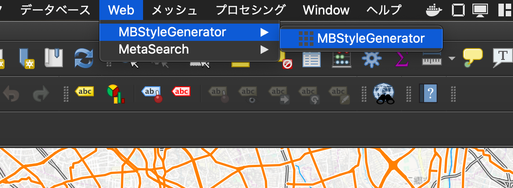
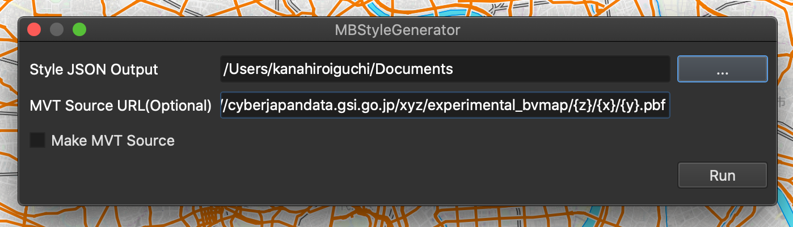
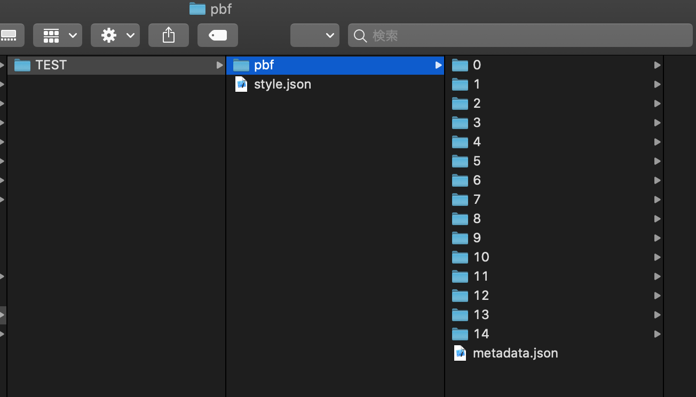
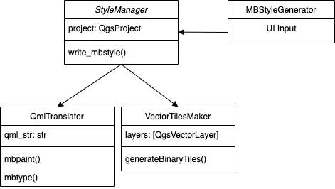

## Caution
Now this plugin is EXPERIMENTAL yet.
Simple object such as Polygon, Line, Point are supported (this mean Text are not supported now).

## Abtract
You can use this plugin in two ways.
One, to generate only Mapbox Style file style.json.
Another, generate style.json and also MVT files - tiled .pbf files.

## Usage
1. In menu bar, Web->MBStyleGenerator, then a dialog will be shown.

2. You set some paramaters, following
- Output Path (style.json will be written)
- MVT Source Url (.pbf files URL, Optional)
- Make MVT Source or not

3. Press Run and then style.json will be generated on the directory you choosed.
It takes some seconds or more to make MVT Source, many vector means longer time.

## Tips
- This plugin will read all VISIBLE layers on your project, including raster tile.
- When MVT Source URL are not set but any vector layer are visible on your project, you have to set hosting URL of MVT Source on style.json manualy.
- A layer name in MVT Source is same to the name in QGIS project.

## License
This plugin is distributed under GPL-2 License.
Also, this plugin use following libraries.
- [mapbox/tippecanoe](https://github.com/mapbox/tippecanoe)
- [bartromgens/togeojsontiles](https://github.com/bartromgens/togeojsontiles)
- [mapbox/mbutil](https://github.com/mapbox/mbutil)

## Classes
